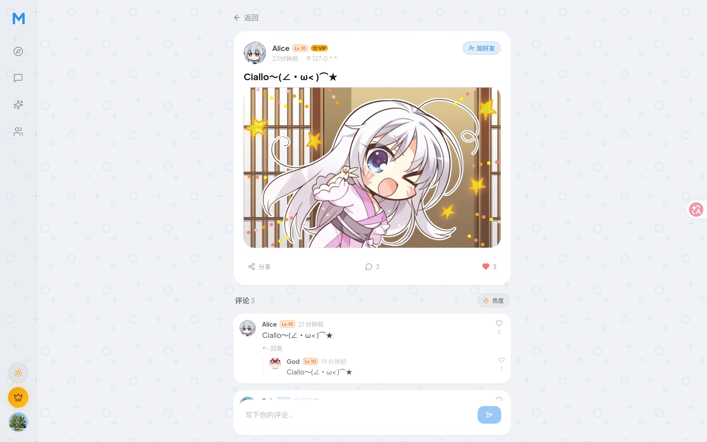
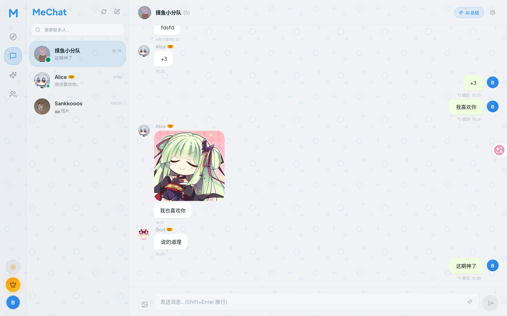
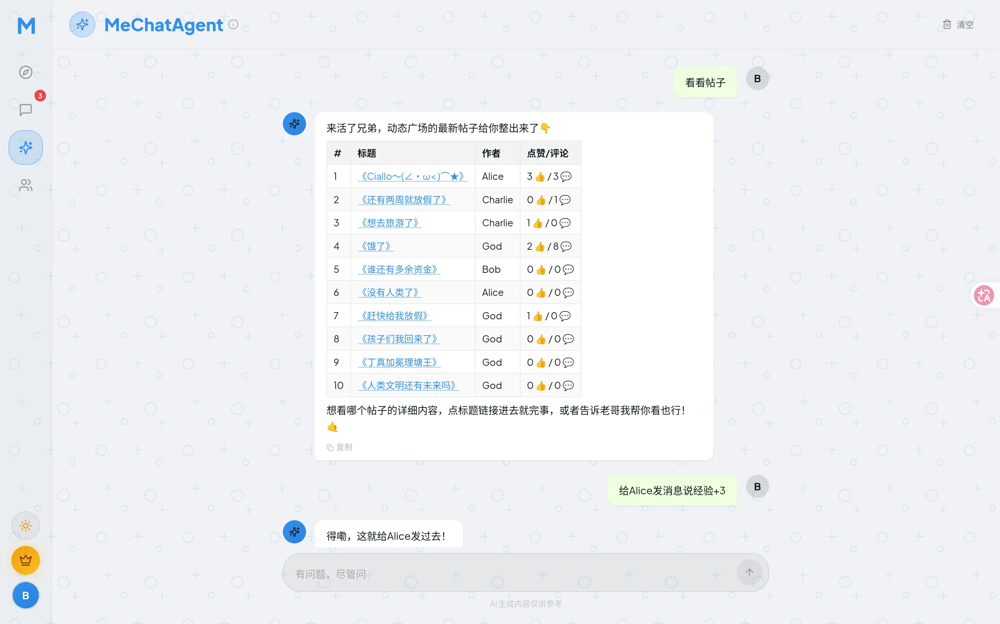
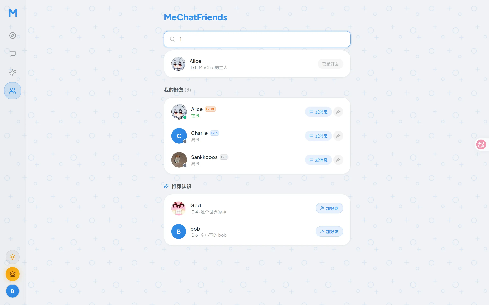
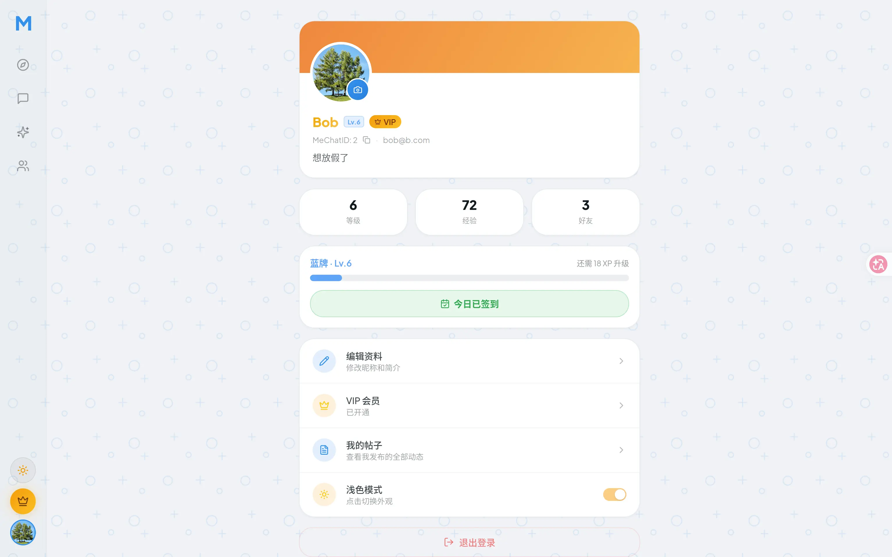

<div align="center">

# MeChat


MeChat 是一个内置AI Agent的全栈社交平台。后端采用 Golang，前端采用 Vue 3，用到的组件有 MySQL，Redis，RabbitMQ，支持使用docker一键部署。

</div>

## 技术栈

- 后端：Go + Gin + GORM + WebSocket + go-redis + RabbitMQ
- AI：Eino，兼容 OpenAI 风格接口
- 前端：Vue 3 + Vite + Pinia + Vue Router + Tailwind CSS + Lucide
- 存储与中间件：MySQL 8 + Redis 7 + RabbitMQ 3.13 + 阿里云 OSS
- 鉴权：JWT（HS256）+ Redis 黑名单
- 部署：Docker Compose + Nginx，雪花 ID，zap 日志

## Docker部署（推荐）

拉取项目后，首先在 `deploy/.env` 文件中填写相关配置项。

确认你的机器上安装了 Docker 和 Docker Compose，并在项目根目录执行以下命令：

```bash
bash deploy-docker.sh
```

## 裸机部署

请先确认你的机器：

- 已安装并启动 MySQL，Redis，RabbitMQ，Nginx
- 已安装 Go 1.25+ 和 Node 18+

填写 `backend/config/config.yaml` 中的配置项

如果想使用 `backend/config/config.yaml` 中提供的默认MySQL dsn，请执行如下SQL语句：

```sql
CREATE DATABASE IF NOT EXISTS mechat DEFAULT CHARACTER SET utf8mb4 DEFAULT COLLATE utf8mb4_unicode_ci;
CREATE USER IF NOT EXISTS 'mechat'@'localhost' IDENTIFIED BY 'mechat123';
GRANT ALL PRIVILEGES ON mechat.* TO 'mechat'@'localhost';
FLUSH PRIVILEGES;
```

最后在项目根目录执行以下命令：

```bash
bash deploy-baremetal.sh
```

---

## 项目展示

MeChatPosts帖子广场，支持发帖，帖子点赞，评论与二级评论，评论点赞。Feed基于即时热度和好友关系。




MeChat聊天，基于WebSocket实现，支持文字和多种图片格式消息类型，支持2分钟内消息撤回。支持基于Redis Pub/Sub 的节点横向扩展。利用 MySQL 实现离线消息防丢。



MeChatAgent助手，使用Eino框架实现工具调用式Agent，目前支持的工具有 查看好友在线状态，查找会话，查找帖子，发送好友申请，发帖等。也在聊天，发帖等地方接入AI总结，写作辅助等功能。



MeChatFriends好友系统，可以通过MeChatID或全局唯一的用户名查找用户并发送好友申请。



经验等级系统，发帖经验+6，签到经验+6，评论经验+3，根据经验值区间赋予灰牌，蓝牌，黄牌，橙牌称号。



## 架构概览

后端按 model / repository / service / handler 四层组织，每个业务域（user、friend、chat、feed、ai、vip、ws、level）是一个独立模块，在 `backend/cmd/server/main.go` 里自底向上装配：DB -> Repositories -> Services -> Handlers -> Router，WebSocket Hub 和 AI 异步任务消费者作为独立 goroutine 启动。

系统有一条完整的降级链，若 OSS 没配置则降级使用本地磁盘存储，若 RabbitMQ 连接失败 AI 任务转为同步执行，若 AI api key 未填写则整体禁用AI业务并在前端隐藏入口，只有 MySQL 和 Redis 为核心依赖没有降级策略。

## 配置说明

Docker 部署只读取 `deploy/.env`，镜像里不带配置文件，后端全部配置来自环境变量

裸机部署只读取 `backend/config/config.yaml`，不涉及环境变量。常用项如下：

| 配置项 | 说明 |
|--------|------|
| `JWT_SECRET` / `jwt.secret` | JWT 签名密钥 |
| `ALLOWED_ORIGIN` / `server.allowed_origins` | 允许的前端来源，默认 `*` |
| `SMTP_*` / `email.*` | 验证码邮箱 |
| `OSS_*` / `oss.*` | 阿里云 OSS |
| `AI_API_KEY` / `ai.api_key` | 大模型 API KEY |

## 项目结构

```
backend/              后端
  cmd/server/         入口 装配依赖 注册路由 优雅停机
  cmd/seed/           测试账号脚本
  config/             配置结构体 + config.yaml
  internal/           业务模块
  pkg/                jwt middleware mq oss redis snowflake email response
frontend/             前端
deploy/               Dockerfile + docker-compose + nginx
deploy-docker.sh      docker一键部署脚本
deploy-baremetal.sh   裸机部署脚本
```

## 本地开发

后端读取 `backend/config/config.yaml` 启动，前端是标准的 Vite 开发服务器：

```bash
cd backend && go run ./cmd/server -config config/config.yaml   # 默认:8080
cd frontend && npm install && npm run dev                      # 默认:5173
```

